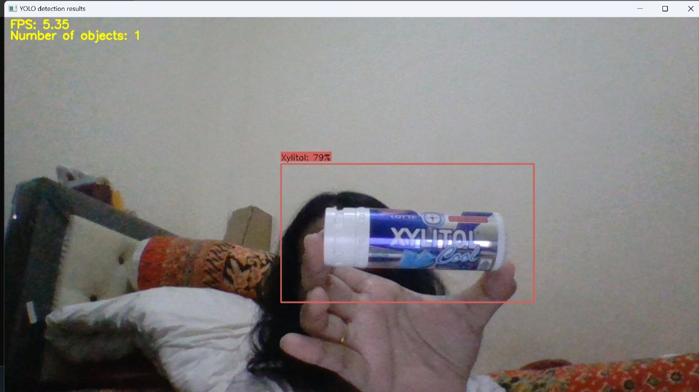

# 🍬 Candy Detection Using YOLOv11s

## 🧭 Overview
This project is part of the final assignment for the **Computer Vision** course, titled **"Candy Detection Using YOLOv11s"**. The goal is to build an automatic detection system to identify candy using the YOLOv11s object detection algorithm. The system is designed to replace manual inspection processes in candy production lines, which are often inefficient and error-prone.

YOLOv11s is chosen for its speed, accuracy, and lightweight architecture, making it ideal for real-time detection tasks. The model is trained on a custom dataset consisting of normal and defective candy images. All training and testing are conducted using Google Colab.

## 📊 Dataset & Preprocessing

### 📸 Data Collection
- Images were captured from the production line using cameras.
- Multiple lighting conditions and candy positions were recorded to increase data diversity.

### 📝 Preprocessing
- **Annotation**: Candy objects were labeled using bounding boxes via LabelImg.
- **Augmentation**: Techniques like rotation, flipping, and brightness adjustment were applied to expand and balance the dataset.

## 🧠 YOLOv11s Model
- Utilizes the YOLOv11s architecture (lightweight version).
- Trained over 60 epochs using Google Colab.
- Dataset split: 90% training, 10% validation.
- Uses data.yaml for configuration.

## 📈 Evaluation Metrics
- Model performance is evaluated using **Precision**, **Recall**, and **mAP** (mean Average Precision).
- Each prediction includes a bounding box, class label, and confidence score.

## 🛠️ Tools & Frameworks
- 🧰 Ultralytics YOLOv11s
- 💻 Google Colab
- 📦 Python (OpenCV, NumPy, Matplotlib, PyYAML)

## ⚙️🛠️ Setup & Installation Guide for Custom YOLO (Google Colab)
- Open Google Colab
Go to https://colab.research.google.com
Create a new notebook.
- Clone the YOLOv5 Repository
- Install the Required Dependencies
- Prepare the Dataset
Each image must have a corresponding .txt label file using YOLO format
- Create the Dataset Config File
- Train the Model
- Run Inference
- Save Your Model
You can download it or copy it to Google Drive for backup.

## 🧪 Implementation Flow
1. Upload data.zip to Google Colab.
2. Extract and annotate the dataset.
3. Generate data.yaml configuration.
4. Train YOLOv11s model using the Ultralytics training command.
5. Test the model with new images.
6. Export the model as .pt or .zip for deployment.

**🖼️ System Mockup:**
The deployment is performed using Anaconda Prompt by running several scripts to activate the camera in real-time. Once the camera is running, users can present a candy in front of it, and the system will automatically detect the object with high accuracy, displaying bounding boxes along with class labels and confidence scores.

    

